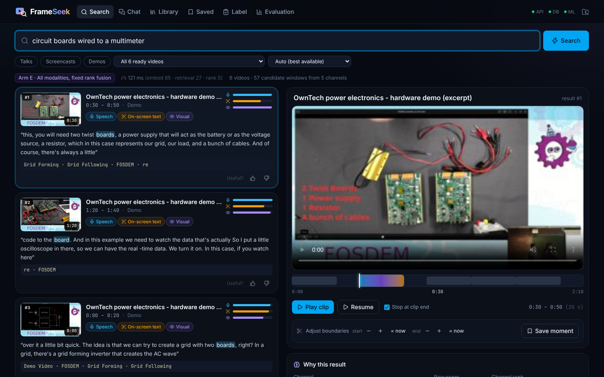
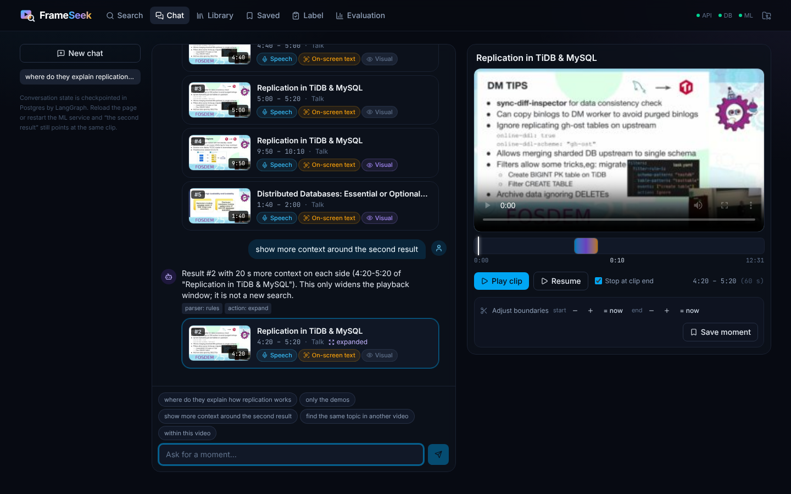
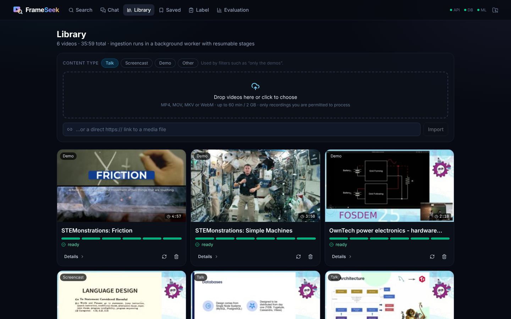
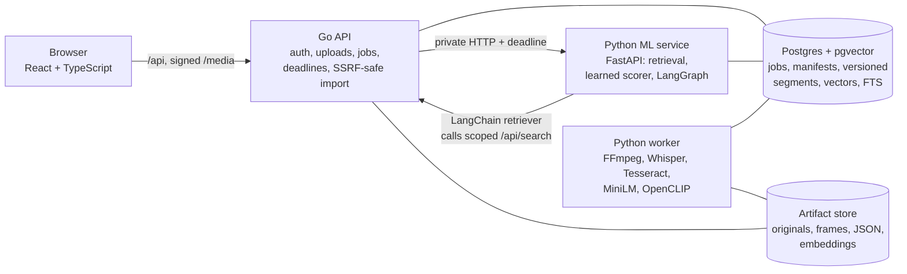

<div align="center">


# FrameSeek

**Find the moment, not just the video.**
Search a library of talks, screencasts and demos by what is *said*, what is *written on screen*, and what is *shown*, and jump straight to a timestamped clip with the evidence that matched.


**[Try the recorded demo](https://sohamb17.github.io/frameseek/)** (no install) · [How it works](#how-search-works) · [Run it locally](#quick-start-windows-macos-linux)



</div>

## Why

Answers in technical videos hide in three different places:

| You remember... | Example query | Where the answer lives |
|---|---|---|
| something the speaker **said** | "where do they explain why replication lags across regions" | speech (ASR transcript) |
| something that was **on screen** | "the `tiup dm deploy` command" | slide or terminal text (OCR) |
| something that was **shown** | "circuit boards wired to a multimeter" | the picture itself (CLIP) |

Transcript search alone misses the last two. FrameSeek indexes all three for every 20-second window, scores each window with five retrieval channels, and fuses them into one ranked list of playable clips, so you can see *why* each result matched.

## What it does

- **Library**: upload MP4/MOV/MKV/WebM or import a direct HTTPS media link. A background worker probes the real streams, makes a browser-safe copy if needed, and shows durable stage progress (queued → extracting → transcribing/OCR → embedding → indexing → ready).
- **Search**: results are timestamped clips with the transcript excerpt, on-screen text, best-matching frame, per-modality match strength, and a "why this result" breakdown. Play from the predicted start, stop at the end, nudge the boundaries, save a bookmark, mark relevant/irrelevant.
- **Chat**: refine in plain language ("only the demos", "show more context around the second result", "find the same topic in another video"). Built with a custom **LangChain retriever** and a **LangGraph** workflow with Postgres checkpoints and human-in-the-loop clarification.
- **Label + Evaluation**: write relevance labels while watching, freeze splits by video group, train the **scikit-learn relevance scorer**, and compare six retrieval arms on held-out queries.

<table><tr>
<td></td>
<td></td>
</tr><tr>
<td align="center"><sub>Conversational refinement with resolvable references</sub></td>
<td align="center"><sub>Library with resumable ingestion</sub></td>
</tr></table>

## Architecture



| Layer | Choice | Responsibility |
|---|---|---|
| UI | React 19, TypeScript, Tailwind | library, search, player, chat, labeling, evaluation dashboard |
| Public API | Go (chi, pgx) | input contracts, owner scoping, idempotent jobs, upload hashing, URL import guard, ML deadlines, signed media URLs, migrations |
| ML service | Python, FastAPI | query embeddings, 5-channel candidate generation, features, fusion / learned ranking, conversation graph |
| Worker | Python, FFmpeg, faster-whisper, Tesseract, sentence-transformers, OpenCLIP | stage pipeline with leases, heartbeats, manifests and atomic publish |
| Storage | Postgres 16 + pgvector (exact search), full-text search | versioned index, jobs, feedback, bookmarks, labels, LangGraph checkpoints |

Details: [docs/ARCHITECTURE.md](docs/ARCHITECTURE.md) · design decisions: [docs/DECISIONS.md](docs/DECISIONS.md) · models and data: [docs/MODEL_CARD.md](docs/MODEL_CARD.md)

## Quick start (Windows, macOS, Linux)

Prerequisites: [Docker Desktop](https://www.docker.com/products/docker-desktop/) (on Windows with the WSL 2 backend) and Git. Everything else runs in containers. First build downloads roughly 4 GB of images and 1 GB of models; an 8 GB laptop is enough (the worker peaks around 1.4 GB).

```bash
git clone https://github.com/sohamb17/frameseek.git
cd frameseek
docker compose up --build -d          # db, api (Go + UI), ml (Python service), worker
```

Open **http://localhost:8080**. Then load the permitted sample library (about 36 minutes of CC BY / public-domain video):

```bash
docker compose exec worker python /app/scripts/fetch_samples.py --out /data/samples
docker compose exec worker python /app/scripts/seed_demo.py --api http://api:8080 --samples /data/samples
docker compose logs -f worker        # watch ingestion (several minutes on a laptop CPU)
```

Or just drag your own recordings into the Library tab.

## How search works

1. **Snapshot**: read every in-scope video's *active index version* inside one `REPEATABLE READ` transaction, so a reindex that publishes mid-query can never mix old segments with new vectors.
2. **Encode the query twice**: MiniLM (for transcript and OCR vectors) and the CLIP text tower (for frame vectors). The two spaces are never compared with each other.
3. **Five candidate channels**, up to 30 windows each: transcript keywords (Postgres FTS), transcript meaning (pgvector), OCR keywords, OCR meaning, and visual (CLIP frames mapped to their windows).
4. **Union and featurize**: every candidate gets *every* channel's score (a window missed by one channel is not treated as missing that modality), plus query-relative scores, reciprocal channel ranks, coverage and missing-modality indicators.
5. **Rank** with fixed reciprocal-rank fusion (arm E) or the learned logistic-regression scorer (arm F), then **temporal non-max suppression** removes overlapping windows.

The evaluation compares six arms on the same index:

| Arm | System | Question it answers |
|---|---|---|
| A | transcript keywords | basic baseline |
| B | transcript semantic | stronger transcript-only baseline |
| C | transcript + OCR, fixed fusion | does on-screen text already solve it? |
| D | visual only | is the visual signal any good? |
| E | all modalities, fixed fusion | does integration help without training? |
| F | E's exact candidate pool, learned scorer | does *learning* the combination help? |

Metric: **query success@K**, i.e. a top-K result in a correct video with temporal IoU ≥ 0.3 against a human-labeled answer interval, plus MRR, candidate recall, localization error, no-answer false positives, grouped bootstrap intervals and p50/p95 latency.

## Results

**Retrieval quality (arms A-F): not measured yet.** The pipeline, metrics and report are implemented and tested. The label set (`eval/labels.assistant.jsonl`, 79 queries) was written and checked by an AI assistant (Claude) from word-level transcript timings, on-screen text and 2-second frames; a random, type-stratified sample of 20 is spot-checked by the author in the Label tab, and training and evaluation refuse to run until that check is done. Every report states who wrote the labels and the spot-check outcome (accepted / corrected / rejected). No retrieval improvement is claimed before then.

**Conversational layer (development set):** 14 scripted dialogues, 35 turns, checked end to end through the API ([full report](docs/results/conversation-dev.md)):

| Property | Result |
|---|---|
| "the Nth / last result" resolves to the item actually displayed | 5/5 |
| type, within-video and exclude-video filters hold for every result | 7/7 |
| topic kept across refinements | 8/8 |
| clarification asked when ambiguous / asked unnecessarily | 3/3 / 0 of 32 |
| duplicate turn replayed, stale turn rejected, other owner blocked | pass |
| stateless search of the follow-up text alone (baseline) | 0% on all three state-dependent checks |

These dialogues were written alongside the rule-based parser, so they show the behaviour works as designed, not how it generalizes; a held-out set written by someone else is still needed. They do not measure whether retrieved moments are relevant.

## Recorded demo (GitHub Pages)

The [online demo](https://sohamb17.github.io/frameseek/) is the same React UI built in demo mode. It reads JSON responses that the real pipeline produced for 10 example queries (every retrieval arm A-E) and two recorded conversations, and streams the clips from the original FOSDEM and NASA files. It cannot search new text or videos; that needs the Docker stack. Regenerate it after reindexing:

```bash
docker compose exec worker python /app/scripts/export_demo.py --out /data/demo
docker compose cp worker:/data/demo/. web/public/demo/
```

`.github/workflows/pages.yml` publishes it on every push to `main` (enable once: Settings → Pages → Source: GitHub Actions).

## Reliability

Ingestion is at-least-once with idempotent effects:

- **Idempotent jobs**: the logical key is `sha256(content hash + index config hash)`, enforced by a partial unique index; resubmitting returns the existing job.
- **Leases and attempt generations**: workers claim with `FOR UPDATE SKIP LOCKED`, heartbeat their lease, and every write is guarded by `WHERE attempt = $mine`, so a stale worker cannot publish.
- **Stage manifests**: input hash, config hash, tool and model versions, output checksums and timings per stage. A retry skips stages whose outputs still verify.
- **Versioned, atomic publish**: a new version's rows are written and the video's active pointer flips in one transaction. A failed reindex leaves the previous version searchable; bookmarks pin the version they were saved against.

```bash
python scripts/reliability_demo.py duplicate        # same job returned
python scripts/reliability_demo.py kill-worker      # kill mid-stage, lease expires, resume from manifests
python scripts/reliability_demo.py failed-reindex   # failure keeps the old version live
```

The stale-completion race is covered deterministically by `ml/tests/test_worker_reliability.py`.

## Conversational search

`interpret → resolve → (clarify) → retrieve | expand → validate → respond`, a bounded LangGraph workflow:

- A rule-based intent parser works with **no API key**. Optionally plug in any OpenAI-compatible model (GitHub Models' free tier, Groq, Ollama) via `.env`; the model only fills a validated schema and never produces IDs.
- "The second result" resolves against the **stored snapshot the user saw**, persisted by a Postgres checkpointer, and survives a service restart.
- Ambiguous references trigger an `interrupt()` with options; the answer resumes the same thread.
- Duplicate turn submissions replay the stored answer, stale turns cannot overwrite newer state, and the owner/collection scope comes from the server-side conversation record.

## Development

Open the folder in VS Code (recommended extensions are suggested automatically). `Terminal → Run Task` lists the common commands (`.vscode/tasks.json`).

```bash
# hot-reload UI on :5173 against the running stack
cd web && npm install && npm run dev

# tests
cd api && go test ./...
docker compose exec db createdb -U frameseek frameseek_test
docker compose exec -e FRAMESEEK_TEST_DATABASE_URL=postgresql://frameseek:frameseek@db:5432/frameseek_test \
  -e FRAMESEEK_SCHEMA_DIR=/app/schema worker python -m pytest -q /app/tests
```

Evaluation workflow (after writing labels in the UI):

```bash
# load the AI-written labels, then do the random spot-check in the Label tab ("Start review")
docker compose exec worker python -m frameseek.eval.labels import --file /app/eval/labels.assistant.jsonl
docker compose exec worker python -m frameseek.eval.labels status       # usable labels, spot-check progress
docker compose exec worker python -m frameseek.eval.labels freeze-splits   # once
docker compose exec worker python -m frameseek.eval.train --activate
docker compose exec worker python -m frameseek.eval.evaluate --split dev   # iterate here
docker compose exec worker python -m frameseek.eval.evaluate --split test  # rarely
docker compose exec worker python -m frameseek.eval.labels export          # labels -> eval/labels.jsonl (commit it)
docker compose exec worker python -m frameseek.eval.conversation_eval      # multi-turn checks (eval/conversation_tasks.json)
```

## Supported inputs

| | Tested | Not supported |
|---|---|---|
| Containers | MP4 (H.264/AAC), WebM (AV1/Opus, transcoded for playback) | anything FFmpeg cannot decode; "every format" is not claimed |
| Sources | file upload, direct HTTPS media URLs (private/internal addresses blocked after DNS and redirects) | website page extraction, logins, DRM, live streams |
| Limits | 60 min and 2 GB per video (configurable) | unlimited video |
| Content | English talks, screencasts, demonstrations | other languages, movies, sports, arbitrary action understanding |

## Project layout

```
api/        Go public API (cmd/server, internal/{httpapi,store,importer,media,migrate,mlclient,config})
ml/         Python package frameseek: worker, pipeline/, models/, retrieval/, conversation/, eval/, service/
web/        React + TypeScript UI
configs/    index.yaml (hashed into job keys), retrieval.yaml
eval/       labels.assistant.jsonl (AI-written labels + spot-check sample), splits.json, labels.jsonl (export after review)
scripts/    sample fetcher, seeding, reliability demos
docs/       architecture, decisions, model card, deployment plan
```

## Limitations

Fixed 20-second windows bound localization precision; isolated frames do not capture actions; OCR on natural scenes is noisy; scores are relevance scores, not calibrated confidence; the demo is single-owner and single-instance, not a production multi-tenant service.

## Sample media credits

FOSDEM 2025 recordings are licensed [CC BY 2.0 BE](https://creativecommons.org/licenses/by/2.0/be/) (speakers and talk pages listed in `scripts/samples.json`). NASA STEMonstrations videos are NASA media (credit NASA; no endorsement implied). Screenshots in this README show frames from these recordings.

## License

MIT, see [LICENSE](LICENSE).
